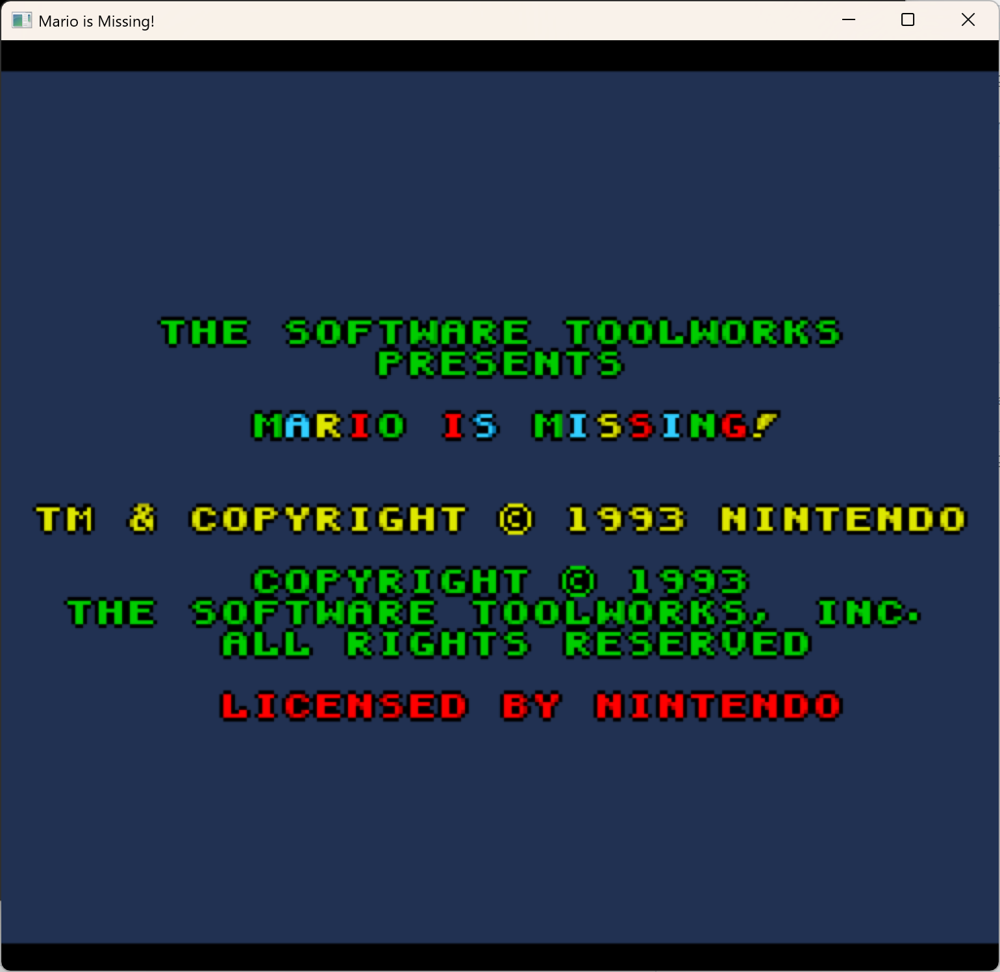
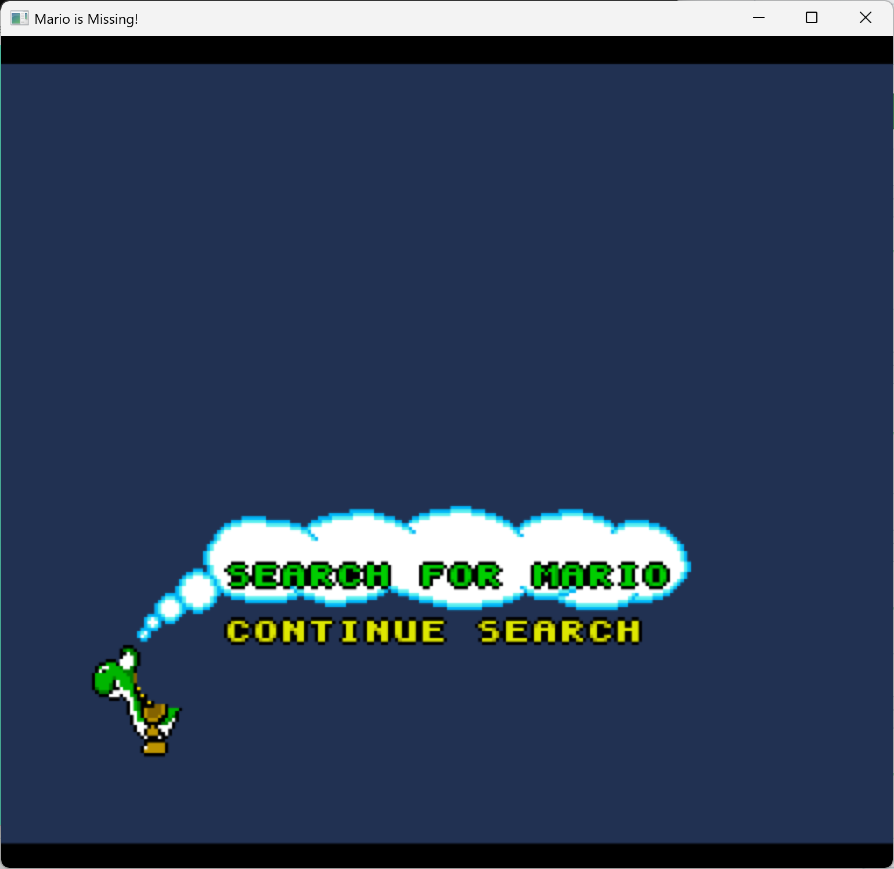
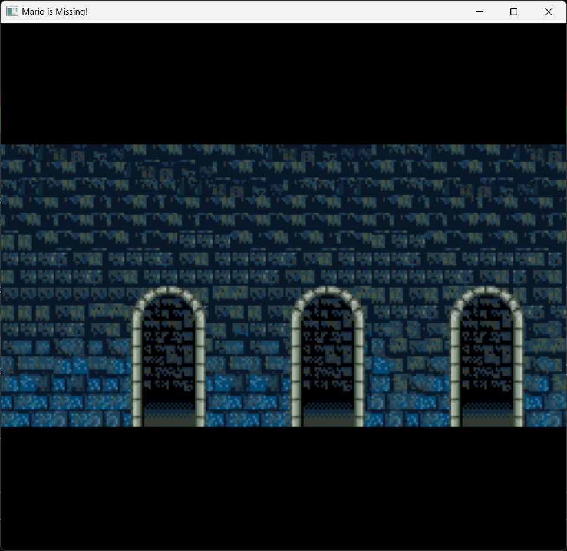

# Mario is Missing! — Static Recompilation

> *"Have you seen Mario? He was right here a minute ago..."*

Static recompilation of **Mario is Missing!** (SNES, 1993) from WDC 65C816 assembly to native C code, playable on modern hardware via SDL2.

This is Luigi's time to shine — again. Nintendo may have forgotten about this game, but we haven't.

Part of the [sp00nznet](https://github.com/sp00nznet) SNES recompilation portfolio, powered by [snesrecomp](https://github.com/sp00nznet/snesrecomp).

## Why This Game?

Mario is Missing is one of those beautifully weird SNES titles that time forgot. It's an **educational geography game** starring Luigi — possibly his first solo starring role — where Bowser steals famous landmarks and Luigi has to travel the world answering trivia to get them back.

What makes it interesting from a recomp perspective:
- **Data-driven design** — the game is mostly question/answer databases and city data, making the code relatively straightforward to follow
- **Surprisingly high-res sprites** — Luigi's walking animations and the city backgrounds are detailed for the era
- **Simple game loop** — walk around, talk to NPCs, answer questions, return artifacts. No Mode 7 racing, no Super FX polygons, just clean 65816 code
- **Abandoned by Nintendo** — this game hasn't seen a re-release, virtual console port, or Switch Online appearance. It's a ghost in Nintendo's catalog. Perfect candidate for preservation through recompilation.

The real goal here is to **drive snesrecomp development** — every new game target pushes the framework forward and helps uncover edge cases in the hardware backend.

## Status

**Project Phase: Bowser's Castle**

The game is playable through the copyright screen, interactive world map menu, and into Bowser's Castle. Full audio playback with SPC700 engine. All three compression formats implemented.





### Progress Tracker

| Milestone | Status | Functions | Notes |
|-----------|--------|-----------|-------|
| Project setup | DONE | — | CMake, snesrecomp submodule, cpu_ops.h |
| ROM analysis | DONE | — | LoROM, 1MB, reset=$8000, NMI=$819D, no SRAM |
| Boot chain | DONE | 7 | Reset vector, PPU init, WRAM clear, DMA loaders, OAM init, RNG seed |
| NMI handler | DONE | 4 | Reentrance guard, OAM DMA, VRAM ring buffer, indirect dispatch |
| SPC700 audio | DONE | 4 | IPL upload, command protocol, asset load/reload |
| Main loop | DONE | 1 | Full game flow: init → title → setup → gameplay loop |
| Decompression | DONE | 5 | All 3 modes: byte-RLE, word-level, LZ bitstream |
| Title screen | DONE | 6 | Copyright screen with full graphics and audio |
| World map menu | DONE | 8 | Yoshi + speech bubble, interactive cursor, world map BG |
| Game state setup | DONE | 6 | $01:8320, $02:8000, PPU mode transitions, fade in/out |
| Bowser's Castle | WIP | 4 | Castle walls rendering, 13 graphics blocks loaded, palettes correct |
| City exploration | TODO | 0 | Luigi walking, NPC interaction, sprite rendering |
| Q&A system | TODO | 0 | Question display, answer selection, artifact return |
| Full playthrough | TODO | 0 | All cities, all artifacts, ending sequence |

**Total recompiled functions: 36+** (72+ registered addresses with LoROM mirrors)

### What's Done
- **Complete boot chain**: reset vector, PPU init, WRAM clear, CGRAM clear, OAM init, DMA table engine, RNG seed
- **Full NMI handler**: reentrance guard, frame counter, OAM DMA, VRAM/CGRAM ring buffer DMA, indirect vector dispatch, INIDISP restore, joypad reading
- **SPC700 audio**: IPL boot upload ($915A), command protocol ($9203), initial asset load ($90EA), audio reload ($913A/$911A) — music plays from boot
- **Decompression engine**: byte-level RLE (mode 1), word-level (mode 2), LZ bitstream with 12-bit ring buffer (mode 3). Optimized with direct ROM/WRAM access for performance.
- **Packed 4bpp tile converter**: converts packed pixel format to SNES interleaved bitplane format ($881B equivalent)
- **Graphics pipeline**: VRAM decompressor+DMA ($8781/$87DF/$8BB7), sprite tile loader ($8F27), tilemap writer ($D11F), tilemap buffer fill ($D18B), two CGRAM loaders ($8E9D/$8EE4)
- **Title screen**: full implementation with Mode 1 BG3, compressed tile graphics, tilemap rendering, Start button detection
- **World map menu**: Yoshi sprite with speech bubble, interactive cursor (Up/Down + palette highlight), world map background (BG1+BG2), per-frame attract mode update ($869B)
- **Game state setup**: $01:8320 with full PPU mode configuration, $02:8000 game logic dispatcher, screen fade in/out ($828C/$82A7), shared graphics loader ($D3D2)
- **Bowser's Castle**: $D4A3 gameplay state machine with PPU setup ($D8A1), 13 compressed graphics blocks loaded to VRAM, 3 palette sets, castle walls with arched windows rendering correctly
- **Main game loop** ($9A5E): complete flow from boot → asset load → title screen → menu → state setup → castle
- **Frame architecture**: game-driven frame loop with `$8249` as frame boundary, `setjmp`/`longjmp` quit handling
- ROM analysis tool (`tools/rom_analyze.py`) with M/X flag-tracking disassembler

### What's Next
1. **World-specific tilemap handlers** ($DA06 chain) — BG1 foreground details for the castle
2. **Luigi sprite rendering** — the player character on screen
3. **Gameplay sub-routines** ($D62B, $D648, $D6DA, $E0C9) — game state updates per frame
4. **City exploration** — walking around cities, talking to NPCs

## Architecture

```
+---------------------------------------------------+
|                  mim_launcher                      |
|  +---------------------------------------------+  |
|  |  src/recomp/ — Recompiled functions          |  |
|  |  mim_boot.c  — Reset, NMI, main loop        |  |
|  |  (more files as recompilation progresses)    |  |
|  +---------------------------------------------+  |
|                       |                            |
|              bus_read8 / bus_write8                 |
|                       |                            |
|  +---------------------------------------------+  |
|  |  snesrecomp — SNES hardware backend          |  |
|  |  Real PPU (Mode 0-7, sprites, HDMA)          |  |
|  |  Real SPC700 + DSP (audio)                   |  |
|  |  Real DMA (8 channels)                       |  |
|  |  Cartridge bus (LoROM auto-detect)            |  |
|  +---------------------------------------------+  |
|                       |                            |
|              SDL2 (window + audio + input)          |
+---------------------------------------------------+
```

The game's 65816 CPU code is recompiled to C functions. Everything else — the PPU that renders pixels, the SPC700 that plays music, the DMA that moves data — is real SNES hardware emulation from [LakeSnes](https://github.com/elzo-d/LakeSnes), packaged as a library by snesrecomp.

## Game Info

| | |
|---|---|
| **Title** | Mario is Missing! |
| **Platform** | Super Nintendo (SNES) |
| **Year** | 1993 |
| **Developer** | Radical Entertainment / The Software Toolworks |
| **Publisher** | Mindscape (not Nintendo!) |
| **Genre** | Educational / Adventure |
| **ROM mapping** | LoROM |
| **ROM size** | 512 KB |
| **CPU** | WDC 65C816 @ 3.58 MHz |
| **Special hardware** | None (no DSP, no Super FX — just clean 65816) |

### The Game in a Nutshell

Bowser has stolen famous artifacts from cities around the world. Mario is... well, missing. Luigi has to travel to different cities, walk around talking to people, answer geography questions to prove which artifact belongs where, and return them to their rightful locations. Do this for enough cities and you rescue Mario.

It's genuinely charming in a 90s-educational-game kind of way. The sprite work is solid, the city backgrounds are surprisingly detailed, and the question database covers real geography that holds up today.

## Building

### Prerequisites
- **CMake 3.16+**
- **SDL2** (via vcpkg or system package)
- **C compiler** — MSVC 2022 (Windows) or GCC/Clang (Linux/macOS)

### Windows (MSVC + vcpkg)
```bash
git clone --recursive https://github.com/sp00nznet/marioismissing.git
cd marioismissing
cmake -B build -G "Visual Studio 17 2022" -A x64 \
  -DCMAKE_TOOLCHAIN_FILE=C:/vcpkg/scripts/buildsystems/vcpkg.cmake
cmake --build build --config Debug
```

### Linux / macOS
```bash
git clone --recursive https://github.com/sp00nznet/marioismissing.git
cd marioismissing
cmake -B build
cmake --build build
```

### Running
```bash
# Place your legally obtained ROM in the project directory
./build/mim_launcher "Mario is Missing! (U).sfc"
```

You need to supply your own ROM file. This project contains no copyrighted game data.

## Project Structure

```
marioismissing/
+-- CMakeLists.txt          # Build configuration
+-- README.md               # You are here
+-- LICENSE                  # MIT
+-- include/
|   +-- mim/
|       +-- cpu_ops.h       # 65816 instruction helpers (LDA, STA, ADC, etc.)
|       +-- functions.h     # Recompiled function declarations
+-- src/
|   +-- main/
|   |   +-- main.c          # Launcher (init, frame loop, shutdown)
|   +-- recomp/
|       +-- mim_boot.c      # Boot chain (reset, NMI, main loop)
+-- tools/                  # Disassembly and analysis scripts (coming soon)
+-- ext/
    +-- snesrecomp/         # SNES hardware backend (git submodule)
```

## Sister Projects

This game is part of a family of SNES static recompilations, all sharing the same [snesrecomp](https://github.com/sp00nznet/snesrecomp) backend:

| Project | Game | Status |
|---------|------|--------|
| [mk](https://github.com/sp00nznet/mk) | Super Mario Kart | 46 functions, through character select |
| [stuntrace](https://github.com/sp00nznet/stuntrace) | Stunt Race FX | 37 functions, attract mode + title |
| [mariopaint](https://github.com/sp00nznet/mariopaint) | Mario Paint | 9 functions, boot chain |
| **marioismissing** | **Mario is Missing!** | **31 functions, title screen + audio** |

Each game project drives improvements in snesrecomp. Super Mario Kart pushed PPU rendering and DMA. Stunt Race FX added Super FX (GSU-2) support. Mario Paint brought SNES Mouse input. Mario is Missing will likely stress-test the **text rendering pipeline** and **data-driven game logic** paths — every game teaches us something new about the hardware.

## Contributing

This is an active development project. If you're interested in:
- **65816 disassembly** — tracing ROM code and figuring out what it does
- **Static recompilation** — converting assembly to C using the cpu_ops helpers
- **SNES hardware** — PPU modes, DMA patterns, SPC700 audio
- **Educational game preservation** — keeping weird 90s games alive

...then jump in! The codebase is intentionally straightforward. Each recompiled function is a direct translation of the original 65816 assembly using human-readable helper functions.

## Legal

This project contains **no copyrighted game data**. You must supply your own legally obtained ROM to run the recompiled executable. The recompilation code itself is original work licensed under MIT.

This is a preservation and education project. Mario is Missing! has not been re-released by Nintendo on any modern platform.
